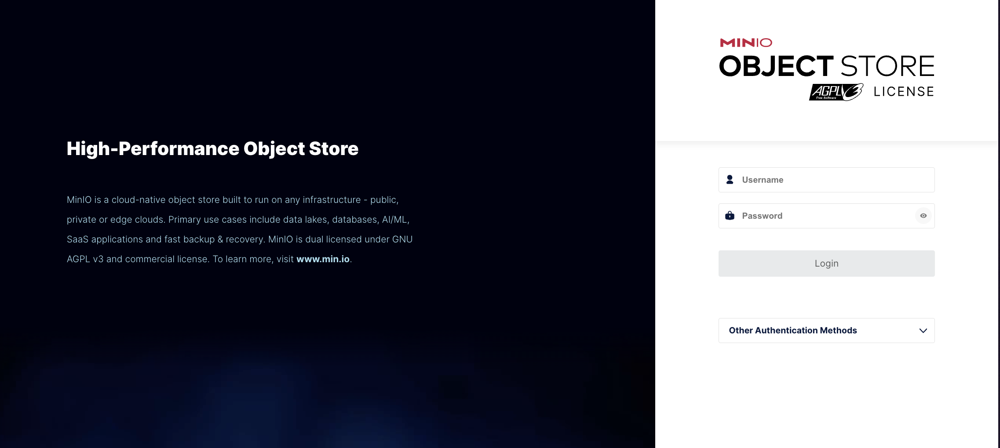
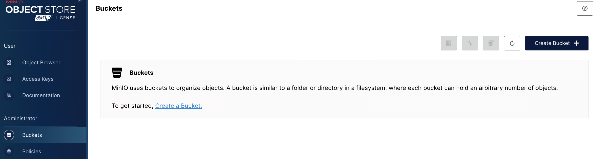
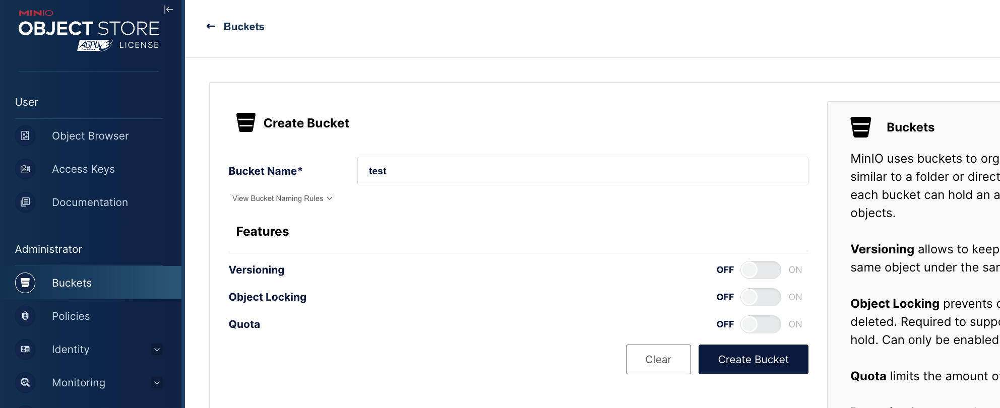
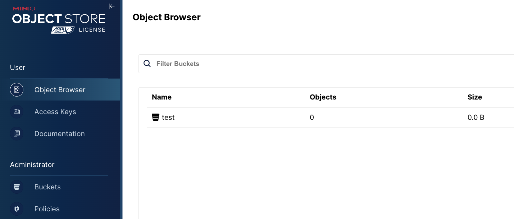
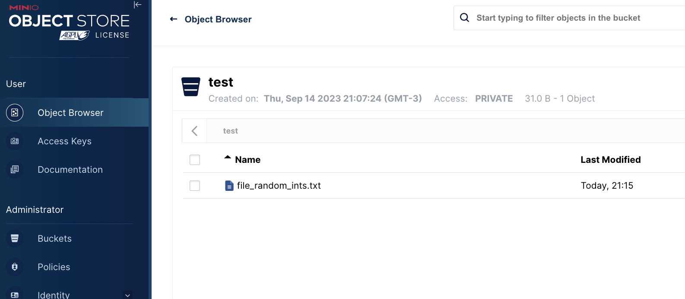

# Cluster MinIO em Kubernetes Local

Esse projeto trata-se de um compilado de comandos e instruções para preparar um cluster local de MinIO rodando sobre Kubernetes.

## Pré-requisitos:

- Docker
  - Um sistema de virtualização que empacota softwares em containers. [Veja a documentação aqui.](https://docs.docker.com/get-docker/)
- Kind
  - Uma ferramenta para orquestrar os containers e criar um cluster de Kubernetes local. [Veja a documentação aqui.](https://kind.sigs.k8s.io/)
- Kubectl
  - Uma ferramenta de linha de comando para administrar seu cluster de K8s. [Veja a documentação aqui.](https://kubernetes.io/docs/tasks/tools/)

- Krew
  - Um plugin de Kubectl usado para instalar e gerenciar aplicações direto pela linha de comando nativa. [Veja a documentação aqui.](https://krew.sigs.k8s.io/docs/)

## Instalando pré-requisitos:

-> Se estiver num sistema Linux:

    ### Instalando docker
    sudo apt-get upgrade
    sudo apt-get install docker.io


    ### Instalando kind

    # AMD64 / x86_64
    [ $(uname -m) = x86_64 ] && curl -Lo ./kind https://kind.sigs.k8s.io/dl/v0.20.0/kind-linux-amd64

    # ARM64
    [ $(uname -m) = aarch64 ] && curl -Lo ./kind https://kind.sigs.k8s.io/dl/v0.20.0/kind-linux-arm64

    chmod +x ./kind
    sudo mv ./kind /usr/local/bin/kind

    ### Instalando kubectl
    # AMD64 / x86_64
       curl -LO "https://dl.k8s.io/release/$(curl -L -s https://dl.k8s.io/release/stable.txt)/bin/linux/amd64/kubectl"

       curl -LO "https://dl.k8s.io/$(curl -L -s https://dl.k8s.io/release/stable.txt)/bin/linux/amd64/kubectl.sha256"


    # ARM64
       curl -LO "https://dl.k8s.io/release/$(curl -L -s https://dl.k8s.io/release/stable.txt)/bin/linux/arm64/kubectl"

       curl -LO "https://dl.k8s.io/$(curl -L -s https://dl.k8s.io/release/stable.txt)/bin/linux/arm64/kubectl.sha256"

    echo "$(cat kubectl.sha256)  kubectl" | sha256sum --check

    sudo install -o root -g root -m 0755 kubectl /usr/local/bin/kubectl

    ### Instalando Krew
    (
    set -x; cd "$(mktemp -d)" &&
    OS="$(uname | tr '[:upper:]' '[:lower:]')" &&
    ARCH="$(uname -m | sed -e 's/x86_64/amd64/' -e 's/\(arm\)\(64\)\?.*/\1\2/' -e 's/aarch64$/arm64/')" &&
    KREW="krew-${OS}_${ARCH}" &&
    curl -fsSLO "https://github.com/kubernetes-sigs/krew/releases/latest/download/${KREW}.tar.gz" &&
    tar zxvf "${KREW}.tar.gz" &&
    ./"${KREW}" install krew
    )

    export PATH="${KREW_ROOT:-$HOME/.krew}/bin:$PATH"

-> Se estiver num sistema MacOS:

    ### Instalando docker e kubectl
    Instalando docker desktop já vem com os 2: https://www.docker.com/products/docker-desktop/

    ### Instalando kind
    brew install kind

    ### Instalando Krew
    (
    set -x; cd "$(mktemp -d)" &&
    OS="$(uname | tr '[:upper:]' '[:lower:]')" &&
    ARCH="$(uname -m | sed -e 's/x86_64/amd64/' -e 's/\(arm\)\(64\)\?.*/\1\2/' -e 's/aarch64$/arm64/')" &&
    KREW="krew-${OS}_${ARCH}" &&
    curl -fsSLO "https://github.com/kubernetes-sigs/krew/releases/latest/download/${KREW}.tar.gz" &&
    tar zxvf "${KREW}.tar.gz" &&
    ./"${KREW}" install krew
    )

    export PATH="${KREW_ROOT:-$HOME/.krew}/bin:$PATH"

---

## Primeiro passo

Primeiro precisamos criar o cluster de Kubernetes onde o MinIO será instalado. Para isso, aplicaremos o arquivo configuração `kind-config.yml` com o seguinte comando:

     kind create cluster --config kind-config.yml

Logo após terminar a criação do cluster, podemos ver que o nosso `kubectl` já aponta para o novo cluster.

    kubectl get all -A

---

## Segundo passo

Com o cluster de K8s criado, devemos agora instalar o MinIO Operator nele, com o seguinte comando:

    kubectl krew install minio

Output:

    Updated the local copy of plugin index.
    Installing plugin: minio
    Installed plugin: minio
    \
    | Use this plugin:
    | 	kubectl minio
    | Documentation:
    | 	https://github.com/minio/operator/tree/master/kubectl-minio
    | Caveats:
    | \
    |  | * For resources that are not in default namespace, currently you must
    |  |   specify -n/--namespace explicitly (the current namespace setting is not
    |  |   yet used).
    | /
    /
    WARNING: You installed plugin "minio" from the krew-index plugin repository.
    These plugins are not audited for security by the Krew maintainers.
    Run them at your own risk.

Agora podemos acessar comandos do MinIO Operator sobre o cluster de K8s.

    kubectl minio
---

## Terceiro passo

Agora vamos iniciar o MinIO Operator e logo após iniciar um cluster de MinIO.

    kubectl minio init

Com o comando acima, o MinIO Operator é criado com todas as dependências necessárias, inclusive um novo *namespace* chamado `minio-operator` que podemos consultar os recursos da seguinte maneira:

    kubectl get all -n minio-operator

Agora temos que criar o cluster de MinIO em si, para isso vamos usar o seguinte comando:

    kubectl minio tenant create                            \
                     minio-cluster                         \
                     --capacity 16Mi                       \
                     --servers 4                           \
                     --volumes 16                          \
                     --namespace minio-operator            \
                     --kes-config minio-kes-secret         \
                     --storage-class warm

Também poderiamos usar a própria UI do MinIO operator, mas como é bastante mais intuitivo, deixaremos para um outro momento.

### **Importante**

>Logo após a criação do cluster, você poderá ver as credenciais root do seu novo cluster. Anote-as para poder usa-las acessando a UI ou outros clients.

---

## Quarto passo

Agora precisamos criar um túnel para acessar os recursos do cluster criado.
- Primeiro para acessar a UI:
  ```
  kubectl port-forward service/minio-cluster-console 9000:9443 --namespace minio-operator
  ```

- Depois para acessar a API:
  ```
  kubectl port-forward service/minio 9001:443 --namespace minio-operator
  ```

Agora temos o cluster de MinIO acessível pelo `localhost`.

A UI está disponível na porta `9000` e a API pela porta `9001`.

---

## Quinto passo

Vamos interagir agora com o cluster pelas duas maneiras, primeiro criaremos um bucket pela UI e depois escreveremos um arquivo nesse bucket usando `boto3` a biblioteca da AWS que interage com os seus serviços que no caso, usaremos o cliente do `S3` que é compatível com o cluster `MinIO`.

Para acessar a UI vá em:

    https://localhost:9000



Primeiro, acesse usando as credenciais que lhe foram dadas ao final do terceiro passo.


Clique no botão `Create Bucket` para criar um bucket.


Coloque o nome que desejar e clique no botão `Create Bucket` novamente, deixaremos as configurações do bucket como default.

Agora com o bucket criado, usaremos o script em python disponibilizado neste repositório `boto_python_example.py` para escrever um arquivo no bucket.

Para isso, tenha Python3 instalado e execute o seguinte comando:

    pip install boto3

Isso irá instalar a biblioteca `boto3` que é utilizada no script.
Agora, coloque as credenciais no arquivo do script e o execute com:

    python3 boto_python_example.py

Os logs confirmarão que um arquivo com alguns números aleatórios foram escritos no bucket.

Voltando à UI:



Clique em `Object Browser` no menu à esquerda e depois acesse o bucket criado anteriormente.



Pronto! Temos um arquivo escrito no nosso cluster que pode ser feito o download pela UI, ou acessado pela API.

---

# Finalizando
Os próximos passos são:
- adicionar o DNS local para não necessitar fazer sempre um `port-forward`.
- criar um cluster de Apache Spark que irá usar o MinIO como filesystem para executar suas tarefas.
